# Projeto de Interface

Pré-requisitos: <a href="2-Especificação do Projeto.md"> Documentação de Especificação</a>

Visão geral da interação do usuário pelas telas do sistema e protótipo interativo das telas com as funcionalidades que fazem parte do sistema (wireframes).

 Apresente as principais interfaces da plataforma. Discuta como ela foi elaborada de forma a atender os requisitos funcionais, não funcionais e histórias de usuário abordados nas <a href="2-Especificação do Projeto.md"> Documentação de Especificação</a>.

## User Flow

Fluxo de usuário (User Flow) é uma técnica que permite ao desenvolvedor mapear todo fluxo de telas do site ou app. Essa técnica funciona para alinhar os caminhos e as possíveis ações que o usuário pode fazer junto com os membros de sua equipe.

> **Links Úteis**:
> - [User Flow: O Quê É e Como Fazer?](https://medium.com/7bits/fluxo-de-usu%C3%A1rio-user-flow-o-que-%C3%A9-como-fazer-79d965872534)
> - [User Flow vs Site Maps](http://designr.com.br/sitemap-e-user-flow-quais-as-diferencas-e-quando-usar-cada-um/)
> - [Top 25 User Flow Tools & Templates for Smooth](https://www.mockplus.com/blog/post/user-flow-tools)

## Wireframes

A seguir são apresentados o desing da interface da aplicação <b>PetCare</b>. 

### Interação com o usuário

Ao acessar o site aparcerá para o usuário a <b>Tela inicial</b> da aplicação.

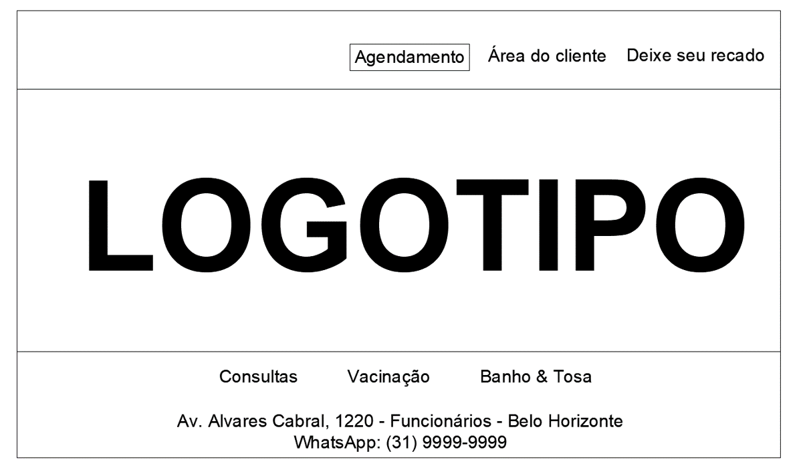

Selecionando a opção <b>Agendamento</b> na Tela Principal aparecerá para o usuário:

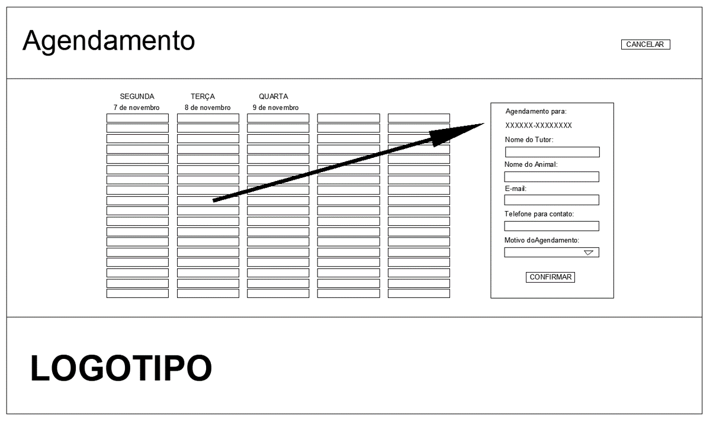

Se o usuário conseguir identificar e selecionar um horário que o atenda aparecerá a tela de <b>Confirmação do Agendamento</b>:

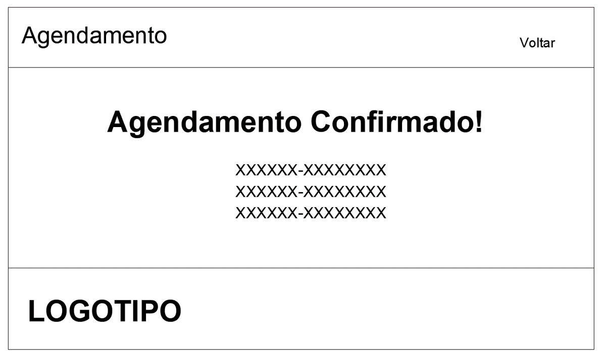

Selecionando a opção <b>Área do Cliente</b> na Tela Principal aparece:

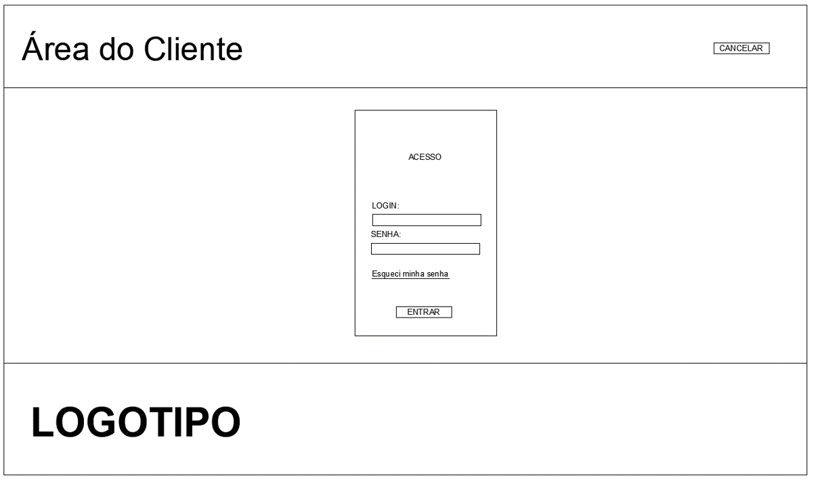

Após o <b>Login de Acesso</b> aparece para o <b>USUÁRIO/b>:

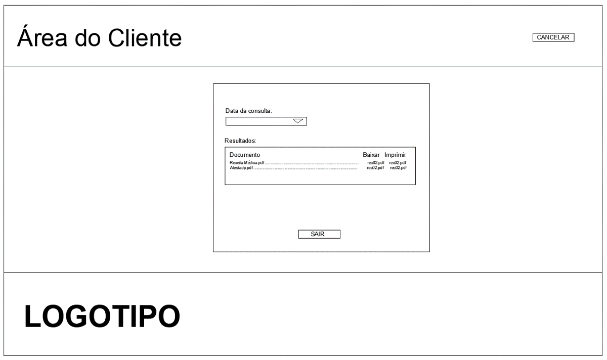

Selecionando a opção <b>Fale Conosco</b> na Tela Principal aparece:

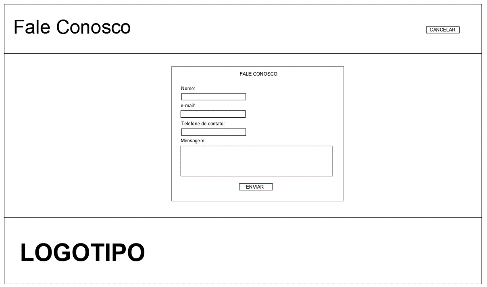

 Ao acessar o site aparcerá para o <b>FUNCIONÁRIO</b> e <b>MÉDICO</b> a <b>Tela inicial</b> da aplicação:

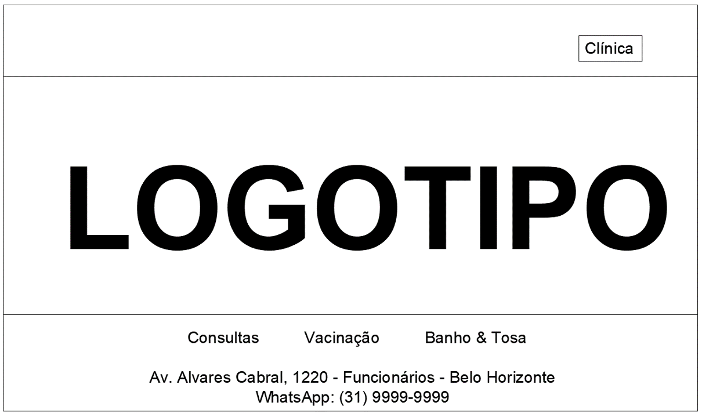

Selecionada a opção <b>Clinica</b> aparece para o <b>FUNCIONÁRIO</b>:

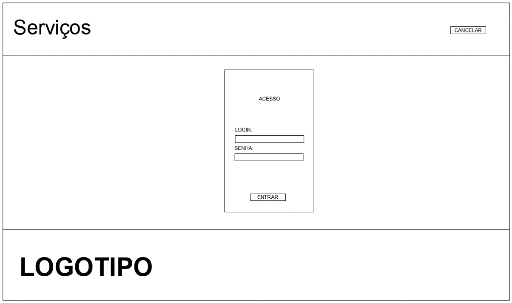

Após o <b>Login de Acesso</b> aparece para o <b>FUNCIONÁRIO</b> a Tela:

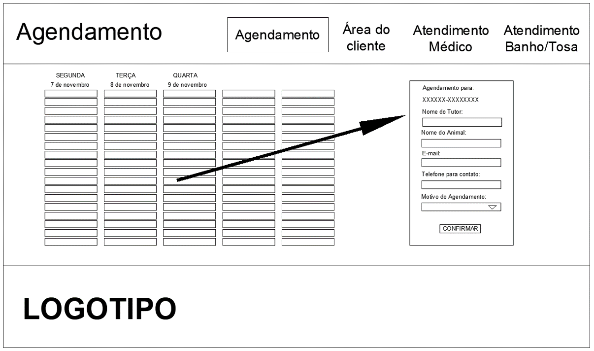

Selecionada a opção <b>Atendimento Médico</b> aparece a funcionalidade que permite a impressão do agendamento de serviço Médico:

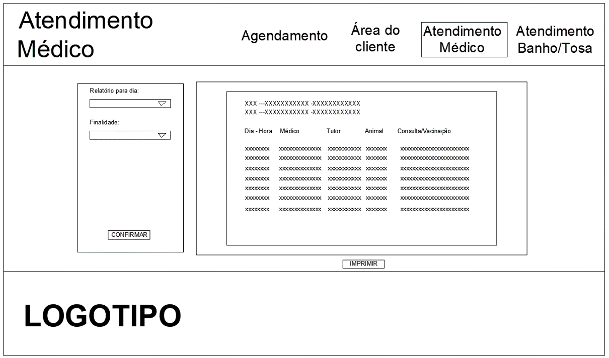

Selecionada a opção <b>Atendimento Banho/Tosa</b> aparece a funcionalidade que permite a impressão do agendamento dos serviços de Banho e Tosa:

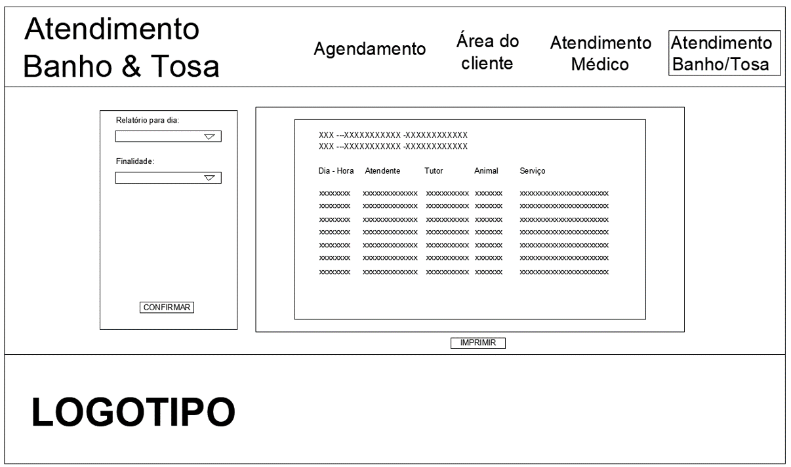
 
Após o <b>MÉDICO</b> logar na tela principal <b>Login de Acesso</b> aparece para a Tela:
 
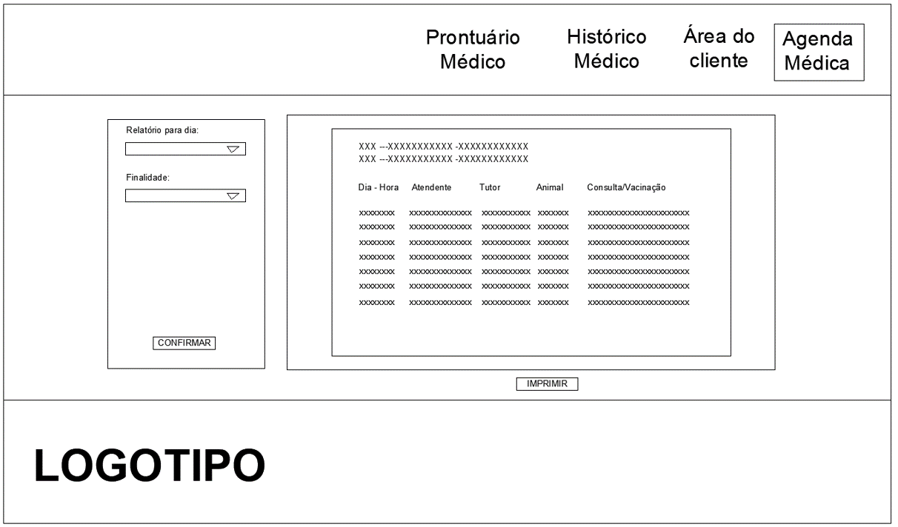
 
Selecionada a opção <b>Histórico Médico</b> aparece para o médico a tela de Histórico Médico:
 
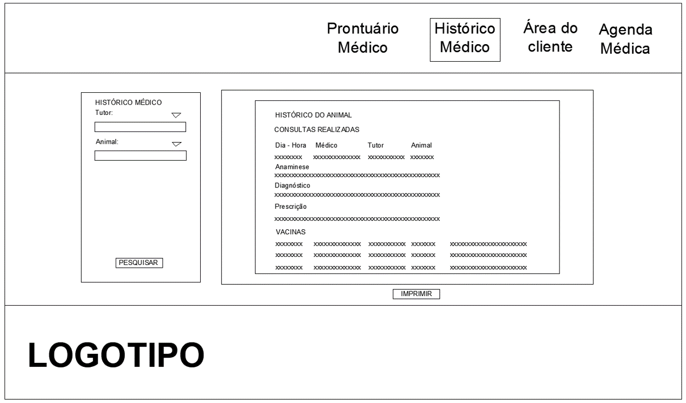
 
Selecionada a opção <b>Prontuário Médico</b> aparece para o médico a tela para preenchimento das informações obtidas na consuta e vacinação:
 
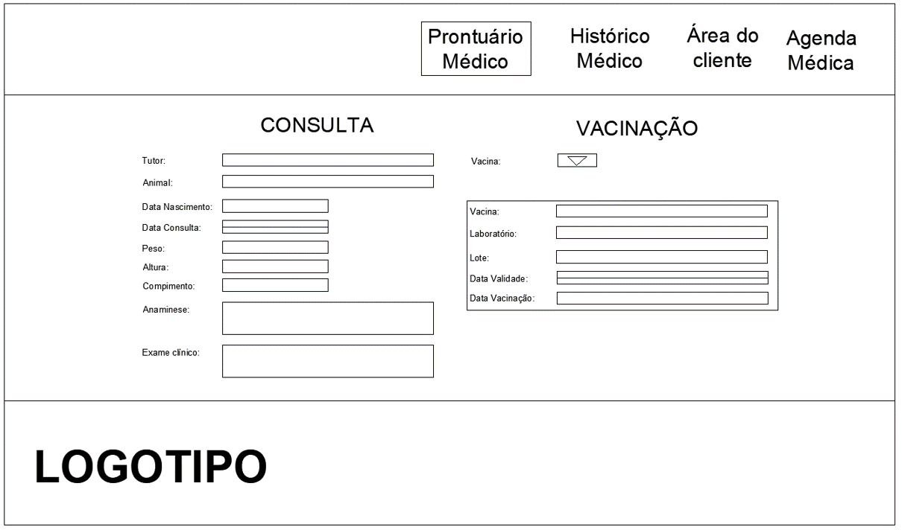

